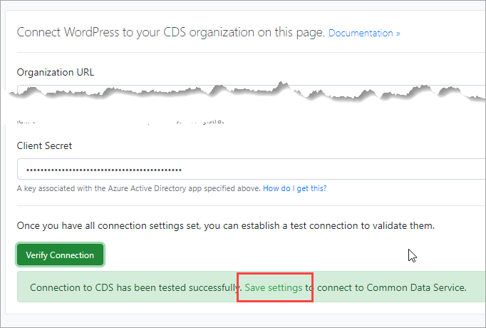

When connecting WordPress instance to Dataverse/CDS, you need to verify and then save the connection configuration.



## Issue

After successfully verifying the connection you may not be able to save settings you click Save settings link but nothing happens.

## Cause 
This problem maybe caused by web server not allowing certain commands (PUT verb) by default. Windows WordPress installation on Azure is known to have this issue.

## Solution

You need to allow additional HTTP verbs on your server including the verb PUT. Specific changes may vary between operating systems, hosting environments, etc. Known installations that exhibit this issue are listed below.

## Windows WordPress installation on Azure

1. Sign into portal.azure.com.
2. Locate and open the App service.
3. Select App Service Editor link and click Go.
4. Select web.config
5. Insert the following lines to allow additional HTTP verbs. NOTE: your path to php-cgi module may vary depending on 32 or 64 bit environment and PHP version.

```php
<configuration>
  <system.webServer>
    <handlers>
<!-- Insert the following lines -->
      <remove name="PHP74_via_FastCGI" />
      <add name="PHP74_via_FastCGI" path="*.php"
        verb="GET, PUT, POST, HEAD, OPTIONS, TRACE, PROPFIND, PROPPATCH, MKCOL, COPY, MOVE, LOCK, UNLOCK" 
        modules="FastCgiModule" scriptProcessor="C:\Program Files\PHP\v7.4\php-cgi.exe" 
        resourceType="Either" requireAccess="Script" />
    </handlers>
```
