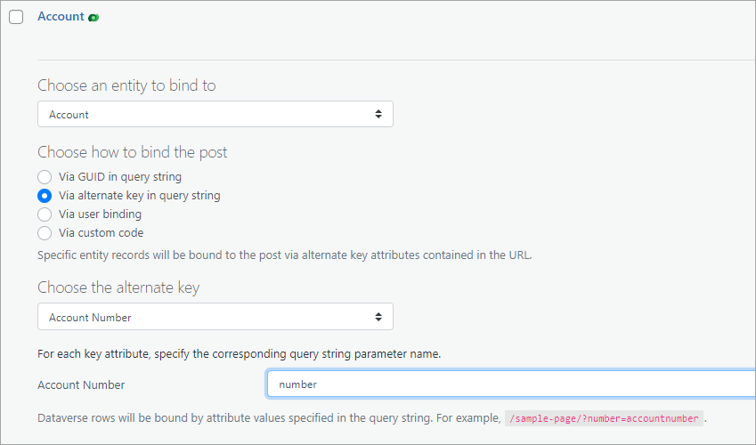

Entity binding provides quick and easy way to associate a page with a specific row in a Dataverse table. Row id can be passed as a parameter or an alternate key can be used out of the box. For example, if we define an alternate key called Account Number for an account table that uses accountnumber column then we can configure account page binding as following:



Once the binding is configured, accounts can be referred using the following format: https://yoursite.com/account/?number=accountnumber.

Sometimes it’s desirable to provide a friendlier URLs, for example https://yoursite.com/account/accountnumer. This is where custom code binding needs to be used.

**Custom slug**<br></br>
First we need to tell WordPress that we want to treat last part of the URL as an account number and not as a page-specific slug. We can do it using the following code:
After successfully verifying the connection you may not be able to save settings you click Save settings link but nothing happens.

```
add_action('init', 'custom_rewrite_tag', 10);
function custom_rewrite_tag() {
  add_rewrite_tag('%accNo%', '([^\/]+)');
}
$accpage = 5; // page id of the account page
add_rewrite_rule(
  '^account\/(?!accNo)([^\/]+)\/?$',
  'index.php?page_id=' . $accpage . '&accNo=$matches[1]',
  'top'
);
```

Once this code is in place we can access account number using get_query_var('accNo') function call.

**Custom filters** <br></br>
Next we need to define two filters. First, given a page url, will return an account record. Second filter will do the opposite: given an account record it will return a page url for that record.

```
use AlexaCRM\Nextgen\ConnectionService;
use AlexaCRM\Xrm\{
  EntityReference,
  Entity,
  KeyAttributeCollection,
  ColumnSet
};

// helper function that returns account entity reference 
// using accNo variable (that is set by custom rewrite tag)
function accountref(string $target) {
  $accountNumber = get_query_var('accNo');
  $keyAttributes = new KeyAttributeCollection();
  $keyAttributes->Add( 'accountnumber', $accountNumber );
  return new EntityReference( $target, $keyAttributes );
}

// return account record for the current url
function account_callback($record, string $target) {
  $webapi = ConnectionService::instance()->getClient();
  $ref = accountref($target);
  return $webapi->RetrieveByReference( $ref, new ColumnSet( true ) );  
}

// return url for the record defined by entity reference
function account_url($url, $post, $ref) {
  $webapi = ConnectionService::instance()->getClient();
  $record = $webapi->RetrieveByReference( $ref, new ColumnSet( true ) );  
  return "https://yoursite.com/account/${record['accountnumber']}";
}

// add custom filters for account page ($accPage defined above)
add_filter('integration-cds/binding/custom/target-' . $accPage , 'account_callback', 10, 3);
add_filter('integration-cds/binding/custom/url-' . $accPage, 'account_url', 10, 3);
```
Once this code is placed in functions.php or custom plugin, account pages can be referenced using slug syntax, e.g. https://yoursite.com/account/abc123