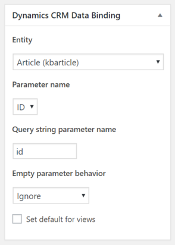

**Dynamics CRM Integration** allows you to bind CRM entities to WordPress pages dynamically. This way you can surface CRM data with [views](./views.md), [forms](./forms.md), [Twig templates](./twig.md), or just raw PHP code.

## Setting up binding for the page

You can configure entity data binding for the page at the page editing screen. All available controls can be accessed in the *"Dynamics CRM Data Binding"* box.



Entity
: Entity name that you want to bind the page to. Lists all available entities in the CRM, default and custom ones.

Parameter name
: Entity attribute to match the page against. *ID* is available for every entity. You can create custom key attributes for specific entities (e.g. email, SKU, etc.).

Query string parameter name
: Name of the parameter in the query string, default is `id`. The value of this query string argument will be matched against the *Parameter name*. For example, URL `/products/view/?id=edef3bae-1603-e711-80fa-5065f38be4f1` will match an entity with type specified in the *Entity* setting, and with ID which equals `edef3bae-1603-e711-80fa-5065f38be4f1`.

Empty parameter behavior
: Allows to choose the right action when the *Query string parameter name* is empty. Available options are "Ignore" and "Page Not Found" -- the latter will trigger a 404 error in the browser.

Set default for views
: If checked, [view records](./views.md) that belong to the selected entity will be linked to this page with correct query string parameters.

## Using bound entities with forms

If you bind the entity by ID, you can surface data from CRM via forms by specifying the `parameter_name` attribute of the form shortcode.

```
[msdyncrm_form entity="product" name="Web Product View" mode="readonly" parameter_name="id"]
```

## Using bound entities with views

You can use attribute values from the current entity record to set up `parameters` and `lookups` attributes in the view shortcode. See documentation on how these shortcode attributes are treated in the [Views documentation](/wpcrm/views/).

```
[msdyncrm_view entity="invoice" name="Invoices for Contact per Department" parameters="{currentrecord.department}" lookups="{contactid:currentrecord.id}"]
```

## Using bound entities with Twig templates

To surface a value for the currently visited entity record, use the `currentrecord` object. More details are available in the [Twig templates documentation](./twig.md).

```
{{ currentrecord.name }}
```

## Using bound entities with raw PHP

In some situations you might want to just write some plain PHP code in order to surface some data on the page. `\AlexaCRM\WordpressCRM\Binding` does all the heavy lifting for you. To access it, use the `ACRM()->binding` shorthand.

Below are some use cases for the entity binding API.

### Get the current entity record for the page

In this example, we have a page with ID 42, which is bound to an entity (e.g. Contact). Below is a fraction of the template for this page (e.g. `page-42.php`).

```twig

```

The plugin doesn't retrieve all columns, only those which are requested. To decide which columns are needed, it parses the post content by default. In order to make the previous example work, you need to add a WordPress filter to `wordpresscrm_data_binding_columns`.

```twig

```

### Build a URL for an entity-bound page

If you need to build a URL for an entity-bound page programmatically, you are presented with a method `buildUrl()` that returns a URL if given an instance of `\AlexaCRM\CRMToolkit\Entity\EntityReference`.

For example, we have a page with address `/invoices/view/`, that is bound to entity *Invoice* which query string parameter `id` which matches the entity record ID, and the page is set as "default for views".

```twig

```