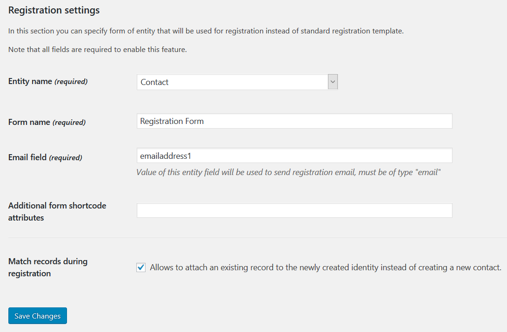

Configuration of the plugin is performed in the WordPress Administration panel. The plugin provides a separate section for that, which is called "Dynamics CRM". You can locate it in the main navigation menu on the left side of the screen.

## Initial configuration

The plugins encrypts stored Dynamics 365 credentials. You must specify a PHP constant `WPCRM_KEY` in `wp-config.php` in order for the plugin to work correctly.

The `WPCRM_KEY` value must be a base64-encoded AES-256 key. You can generate one yourself, or use one of the online services, e.g. [http://www.digitalsanctuary.com/aes-key-generator.php].

## Connection

Microsoft Dynamics CRM supports two security models for authentication: claims-based authentication and Active Directory authentication. The type of authentication used depends on the type of deployment your application is accessing: Microsoft Dynamics 365 or Microsoft Dynamics CRM. CRM Plugin supports both CRM Online (Deployment type: Office 365) and CRM on-premises deployment (Internet-Facing Deployment).

Deployment type
: Internet Facing (On-premises) or CRM Online (Office 365). If your CRM domain is `*.dynamics.com` then you are using **CRM Online.** Otherwise choose **On-premises.**

Dynamics CRM Address
: Absolute URL to your Microsoft Dynamics CRM, e. g. `https://contoso.crm.dynamics.com` for CRM Online, or `https://crm.example.net` for the on-premises deployment.

Application ID
: Azure AD application registration identifier. The app user mapped to this registration will be used to authenticate and access the CRM data, please ensure that the user has sufficient permissions to access Dynamics CRM.

Client Secret
 Application registration secret as defined in Azure AD. Make sure the secret has not expired.

Step-by-step instructions how to create app id and secret are available in [this knowledge base article](https://alexacrm.com/kb/plugin/config/oauth-setup/).

### Using the exact specified STS URL

**TL;DR:** Check this box if you are using federated authentication and running into connection problems.

For Online deployments you may notice another setting, **Federated login only: use the exact specified STS URL.** In scenarios with federated authentication, the plugin first makes a request to Azure AD to determine the federated STS URL. Most commonly it points to the UsernameMixed endpoint in ADFS. 

However, in some cases an unsupported ADFS endpoint may be specified by Azure AD, or non-ADFS integration may be employed. The default behavior for the plugin is to use the specified domain and the hard-coded endpoint, `/adfs/services/trust/13/usernamemixed`.

When a non-ADFS solution is employed, or ADFS is being used in a non-supported way, such behavior may actually make things worse. For that reason, please check this box to make the plugin use the exact STS URL as reported by Azure Active Directory.

## Portal

<Highlight color="#25c2a0">Premium feature! This feature is available in the premium extension.</Highlight>

**Delete Unlinked Users** removes all CRM-managed WordPress users which do not have a corresponding WP Identity record in CRM. Useful if you have deleted a lot of WP Identity records or user names were changed.  

In the **Login Settings** section, you can configure the entity to bind users to. *Contact* is the default entity.

Check **Authenticate new users against Dynamics CRM by default** if you want newly created WordPress users to be automatically authenticated against Dynamics CRM.

## Registration

:::info

Premium feature! This feature is available in the premium extension.

:::

This tab provides extra options for the `[msdyncrm_registration]` shortcode.

Configure these options to show a CRM form instead of the default registration form. 

Pick the entity -- it should be the same entity chosen on the Portal tab in the Login Settings section. Specify the form you want to use in the **Form name** field, enter the name of the attribute to use as user name in **Email field.** Additional form parameters may be configured in the **Additional form shortcode attributes** field -- see [Forms](./forms.md).

Check **Match records during registration** if you want to reuse existing records (e.g. contacts) with matching email addresses. It will create new records every time if unchecked. 

## Roles

:::info

Premium feature! This feature is available in the premium extension.

:::

The plugin will ask you to install default identity roles in CRM to provide role management for CRM-managed users. Click **Install Default Roles** to do that.

After identity roles are in place, you can configure mapping of identity roles to WordPress roles. Map unused identity roles to *None*.

## Forms

Enable and configure reCAPTCHA in forms using the Forms tab.

## Messages

In the Messages section you can configure various messages that the plugin prints out on the web site.

## About

You can configure the logging verbosity on the About tab.

:::info

Premium feature! This feature is available in the premium extension.

:::

To install the license for the premium add-on, pick your edition (Pro, Business, Enterprise) and enter the license key. Click the **Activate** button.
