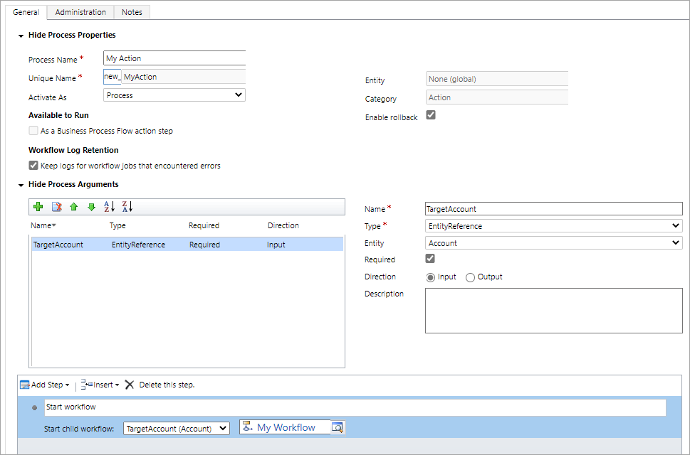

While it’s not possible to call any workflow directly there is a simple workaround that involves using custom actions.

1. Make sure that your workflow can be called `As a child process`.
2. In your Dynamics 365 instance create a custom action for the `(None)` entity type, with one parameters, `EntityReference` of the same type as your workflow, e.g. `account`. Let’s say your action is `new_myaction` and the only step it has is calling your workflow:



3. Add PHP code to call the custom action:

```
$ref = new \AlexaCRM\CRMToolkit\Entity\EntityReference( 'account', $accountid );
$request = [
  [
      'key' => 'TargetAccount',
      'type' => 'EntityReference',
      'value' => $ref
  ]
];
 
ASDK()->executeAction( 'new_MyAction', $request );
```