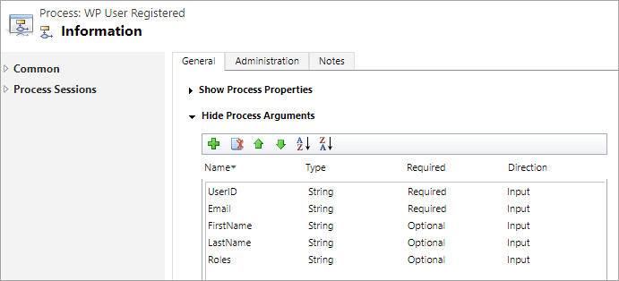

Dynamics 365 plugin has built-in notifications when a WordPress user is created, updated, or deleted. Custom actions associated with these events are distributed as part of the Dynamics 365 solution and can be customized further to perform the required operations.

The parameters passed into these actions are limited to UserId, Email, and list of Roles. If additional parameters like user’s first name or last name are required, then it’s very easy to create and call your own custom action.

Let’s say you defined in Dynamics 365 a custom action `foo_WPUserRegistered` with the following parameters:



Code in WordPress that calls that custom action when a user is registered would look like the following:

```
add_action( 'user_register', function( $userId ) {
    $client = ACRM()->getSdk();
    if ( !$client || !\AlexaCRM\WordpressCRM\Solution::isInstalled() ) {
        return;
    }
    $user = get_userdata( $userId );
    if ( $user === false ) {
        return;
    }
    $request = [
      [
        'key' => 'UserID',
        'type' => 'string',
        'value' => $user->ID,
      ],
      [
        'key' => 'Email',
        'type' => 'string',
        'value' => $user->user_email,
      ],
      [
        'key' => 'FirstName',
        'type' => 'string',
        'value' => $user->first_name,
      ],
      [
          'key' => 'LastName',
          'type' => 'string',
          'value' => $user->last_name,
      ],
      [
          'key' => 'Roles',
          'type' => 'string',
          'value' => implode( ',', $user->roles )
      ]
    ];
    try {
        $client->executeAction( 'foo_WPUserRegistered', $request );
    } catch ( \Exception $e ) {}
}, 100 );
```

Note that action parameter names are case-sensitive and, for example, using 'key' => 'userid' instead of 'key' => 'UserID' would result in a runtime error (that you can catch as an exception).