IMPORTANT! To complete the steps below you need to have one of the following roles in Azure Active Directory: Dynamics 365 Administrator, Power Platform Administrator, or Global Administrator.

**Register application in Azure Active Directory**  
1. Navigate to https://portal.azure.com in your browser.
2. Select Azure Active Directory. If it is not available on the screen, select search bar and type azure active directory then select it from the search results.

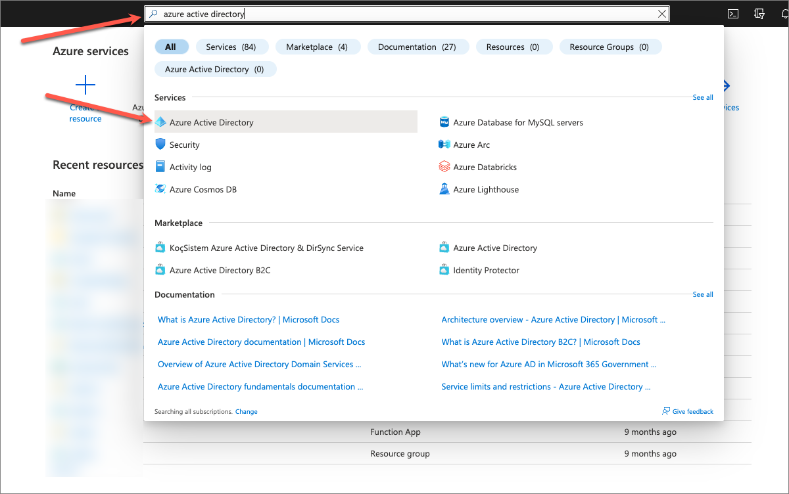

3. Select App Registrations then press + New Registration.

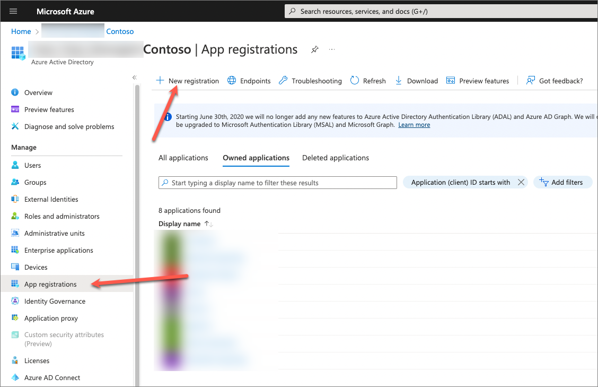

4. Enter app name, for example WordPress App and press Register.

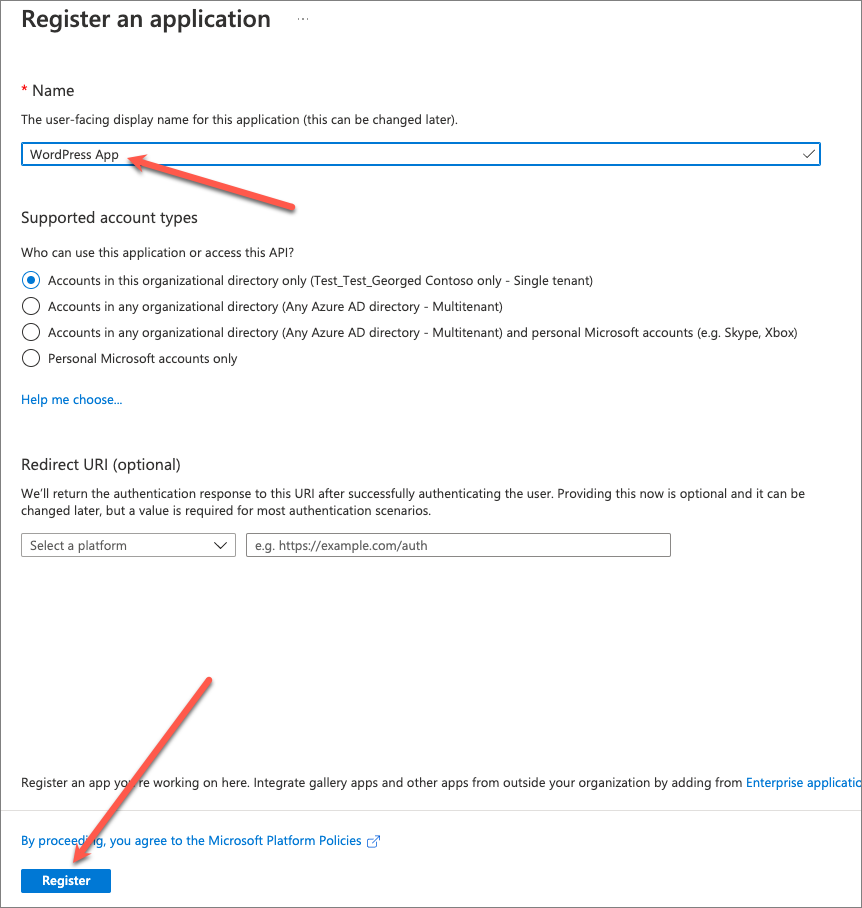

5. After the app registration has been created, copy Application (client) ID value, and set it aside.

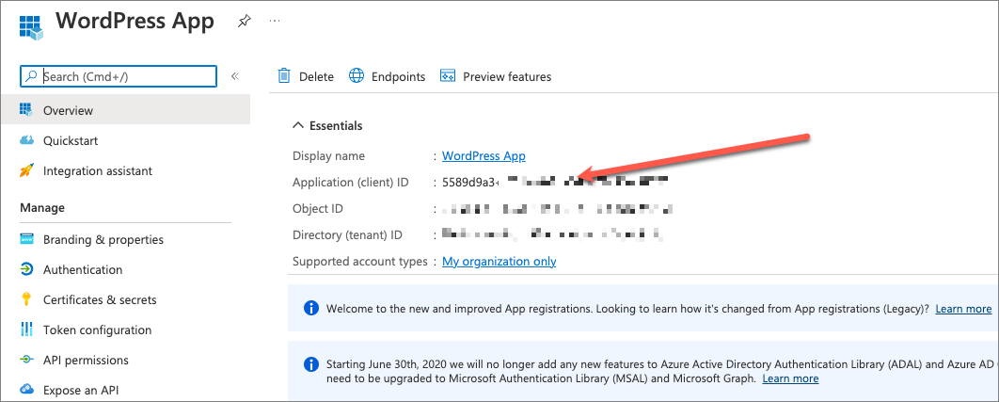

6. Select `Certificates & Secrets`, then press `+ New client secret`.

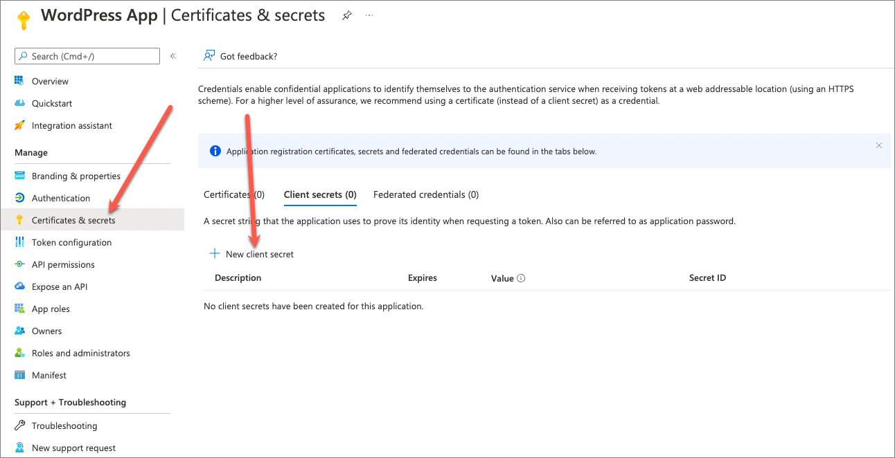

7. In the Add a client secret side panel enter a human-readable name for the secret, select appropriate expiration period, and press Add.

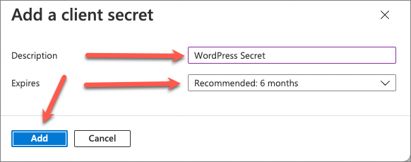

8. After the secret is created, copy the secret value, and set it aside. `Important`: this value is displayed only once, it’s important to copy it. If you navigate away from that screen without copying the value, new secret will have to be created.

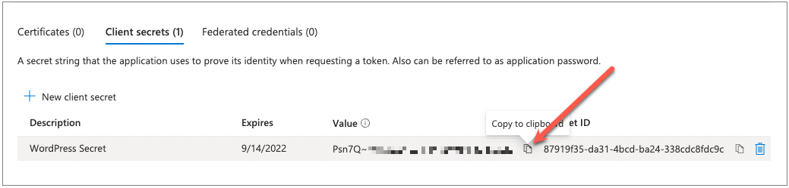

By now you should have app id and secret values set aside. These are the values to be used on the Connection tab of the plugin.

**Create application user in Dataverse**

1. Navigate to [Power Platform admin center](https://admin.powerplatform.microsoft.com/).
2. Select target environment.
3. On the settings screen select `S2S Apps > See all`.

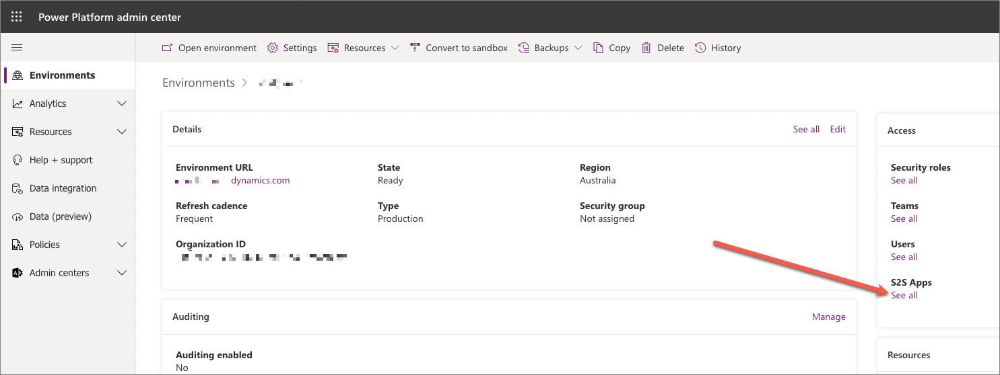

4. On the `Application users` screen select `+ New app user`.

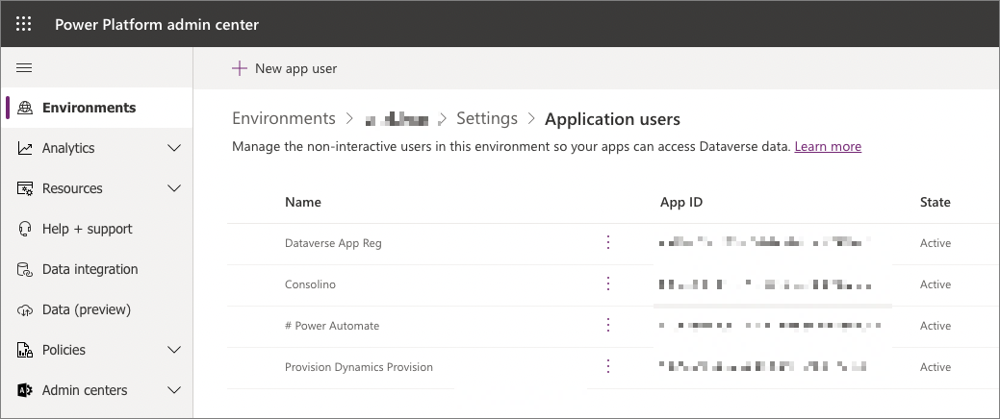

5. In the `Create a new app user` side panel do the following:
  - Press pencil next to `App` and select app registration created earlier
  - Select business unit. Usually it’s the root business unit providing access to the entire organization.
  - Select security roles. We recommend selecting `Basic User` role providing access to metadata and base tables + additional role to satisfy specific access requirements. For example, if the web site needs to display cases then at least read access to Cases table should be included in that role.
  - Press `Create` button.

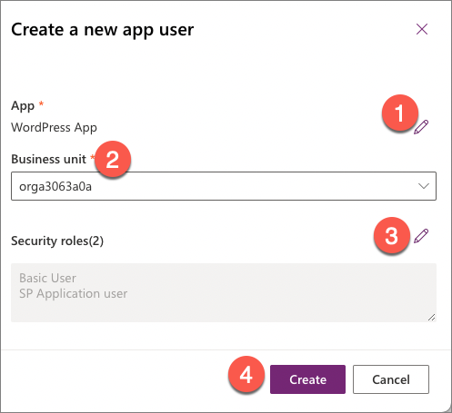

6. Confirm that the app user was successfully added to the environment.

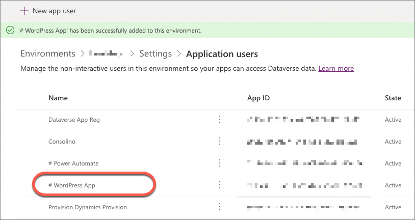

You can now use app id and client secret created earlier in the plugin configuration dialog.