This quickstart guide tells in brief how to install the plugin and start capturing leads from you site directly into Dynamics 365.

## Installation

Go to **Plugins > Add New** in your WordPress administration panel. Type *"Dynamics 365 Integration"* into the "Search Plugins..." text field. After the plugin is found, click "Install Now", then click "Activate" after the plugin is installed.


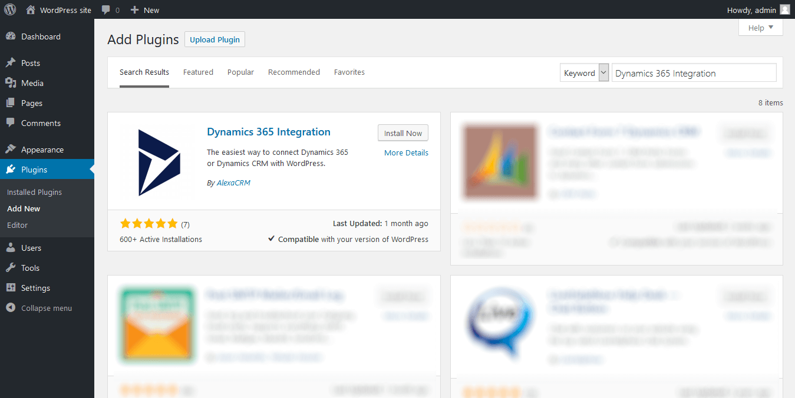

Once the plugin is activated, go to **Dynamics 365 > Connection** and configure the connection to your Dynamics 365 instance. Plugin supports two authentication methods: App Id/Client Secret (Online only) and Username/Password (Online and On-Premises). 

**Note**: Username/Password authentication has been deprecated for Online deployments and will be removed in April 2022.

### App Id / Client Secret authentication

Choose the *CRM Online* deployment type. Enter the URL of your Dynamics 365 organization, and specify app id and client secret to access your Dynamics 365 instance.

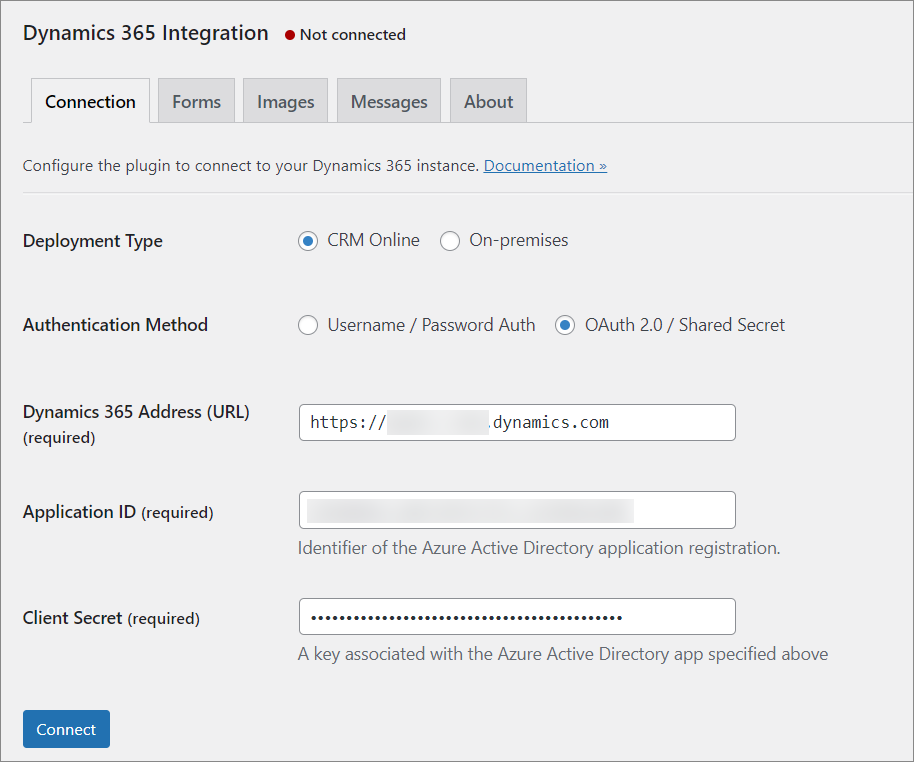

If you do not have app id/secret ready then you need to complete the following steps:

1. [Register an app](https://docs.microsoft.com/azure/active-directory/develop/quickstart-register-app#register-an-application) in Azure Active Directory. During the registration select **Accounts in this organizational directory only** as Supported account types. Stop the walkthrough after the step when the app is registered, do not add redirect URI or change platform settings. Copy Application (client) ID and set aside.
2. [Add client secret credentials](https://docs.microsoft.com/azure/active-directory/develop/quickstart-register-app#add-credentials). Copy client secret and set aside.
3. Create an application user in Dataverse by following [these instructions](https://docs.microsoft.com/power-platform/admin/manage-application-users#create-an-application-user). Make sure to [assign roles](https://docs.microsoft.com/power-platform/admin/manage-application-users#manage-roles-for-an-application-user) to the user.
4. Use application id and client secret in the plugin configuration dialog.

[This knowledge base article](https://alexacrm.com/kb/plugin/config/oauth-setup/) contains step-by-step instructions and screenshots to guide you through the process. 

### Username / Password authentication 

Once the plugin is activated, go to **Dynamics 365 > Connection** and configure the connection to your Dynamics 365 instance. Choose the appropriate deployment type, *CRM Online* or *On-premises.* Enter the URL of your Dynamics 365 organization, and specify user name and password to access your Dynamics 365 instance.


After connecting to Dynamics 365 you should see the message "Connected to &lt;Your Organization Name&gt;".

You can find more information about connection settings at the [Configuration documentation page](configuration#connection)

## Surface a Dynamics 365 form in WordPress

Let's surface a form from your Dynamics 365 organization using the Dynamics 365 Integration plugin.

### Creating a form in Dynamics 365

You can create a new custom form in Dynamics 365 or use an existing one. If you want to use an existing form you can skip this section.

To create a new form first open the Solution Explorer window with you desired solution or the default solution.
For more information about solutions please refer to [Dynamics 365 Solutions documentation](https://docs.microsoft.com/en-us/dynamics365/customer-engagement/customize/solutions-overview).

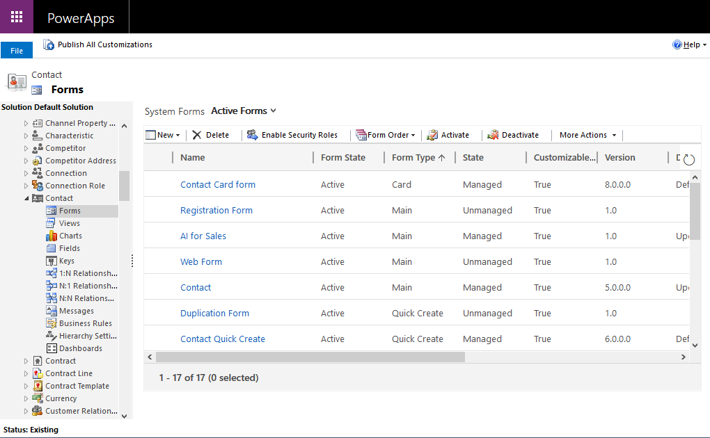

In Solution Explorer navigate to **Components > Entities** section and choose the desired entity, for example, *Contact*. Expand the selected entity node and select *Forms*. Click the *New* button and select the desired form type.
For more information about form types please see [Create and design forms](https://docs.microsoft.com/en-us/dynamics365/customer-engagement/customize/create-design-forms).

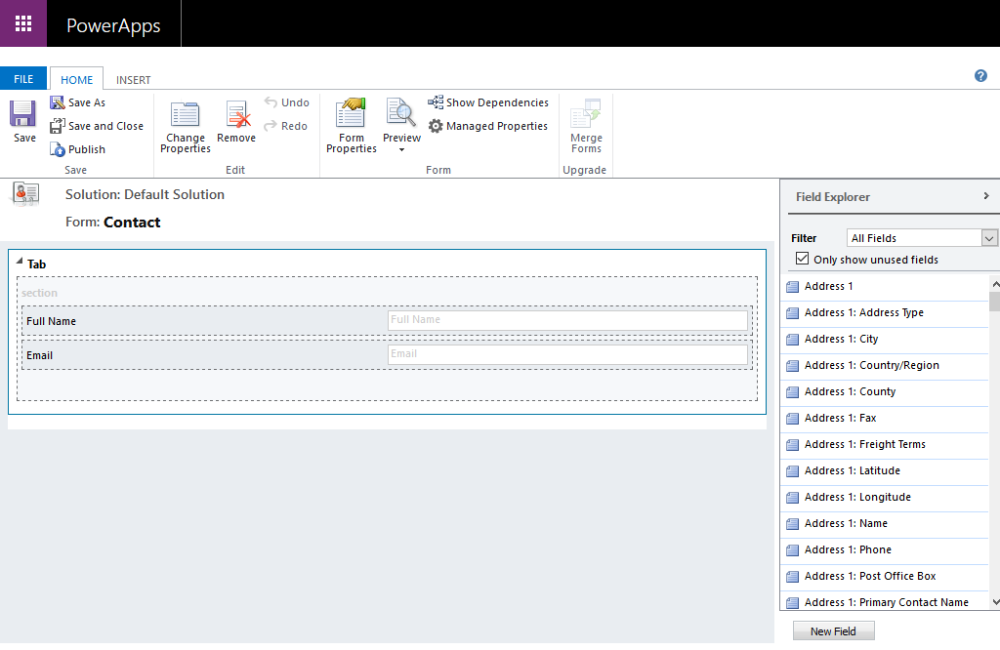

Now you can create and save the new form using the form editor.
For more information about the form editor please see [Form editor documentation](https://docs.microsoft.com/en-us/dynamics365/customer-engagement/customize/form-editor-user-interface-legacy).

Please don't forget to specify the name of your custom form and publish it.

### Adding a form to a page

Create a new page in your WordPress administration panel by navigating to **Pages &gt; Add new** or open an existing one from **Pages &gt; All pages** menu section. Don't forget to enter page title if it's a new page.

Switch the content editor mode to plain text by clicking on the *Text* tab. Finally insert the following code into the editor:

```twig
[msdyncrm_twig]

[/msdyncrm_twig]
```

In `create` mode the form will create a new record in CRM.


Click *Publish* button on the right sidebar to publish your new page or *Update* button if you are editing an existing page.

Now you should see your form on a website page. This form will submit new contacts directly to Dynamics 365.

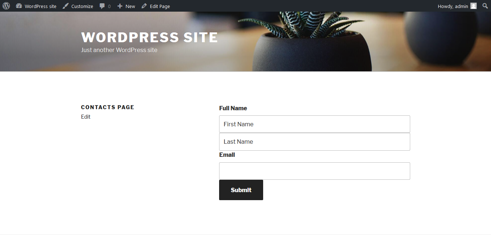

You can find more information about creating forms at the [Twig Templates documentation page](twig#forms)


## Surface Dynamics 365 records in WordPress

Now let's surface some information from your Dynamics 365 organization using the Dynamics 365 Integration plugin.

### Creating a view in Dynamics 365

To surface information from Dynamics 365 on your website you can use System Views as well as Personal Views. Let's create a new Personal View for demonstration purpose. If you want to use an existing view you can skip this section.

To create a new Personal View first open an existing System View of some entity, for example, *Active Contacts* and when click *Advanced Find* button on the top panel to open the Advanced Find window. Now you can create new Personal View and save it with some specified name, for example 'Filtered Contacts'.

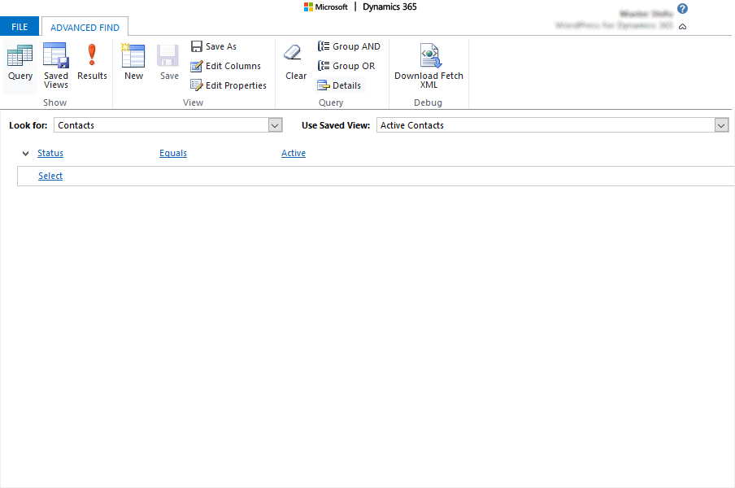

Please note that personal views must be shared with the user you use to connect WordPress to Dynamics 365 before you start surfacing them on your website. To achive this click *Saved Views* on the toolbar, select the view you just created, and click *Share* button. The mentioned user must have *read* access to view in order to surface it in WordPress.


For more information about creating and editing Views in Dynamics 365 please refer to [Dynamics 365 Views documentation](https://docs.microsoft.com/en-us/dynamics365/customer-engagement/customize/create-edit-views).

### Adding a view to a page

Create a new page in your WordPress administration panel by navigating to **Pages &gt; Add new** or open an existing one from **Pages &gt; All pages** menu section. Don't forget to enter page title if it's a new page.

Switch the content editor mode to plain text by clicking on the *Text* tab, and insert the following code into the editor:

```twig
[msdyncrm_twig]

[/msdyncrm_twig]
```

We added `count` parameter to enable result pagination and limit the number of records per page to 10, and `cache` parameter to store retrieved  data in site cache for 1 hour.

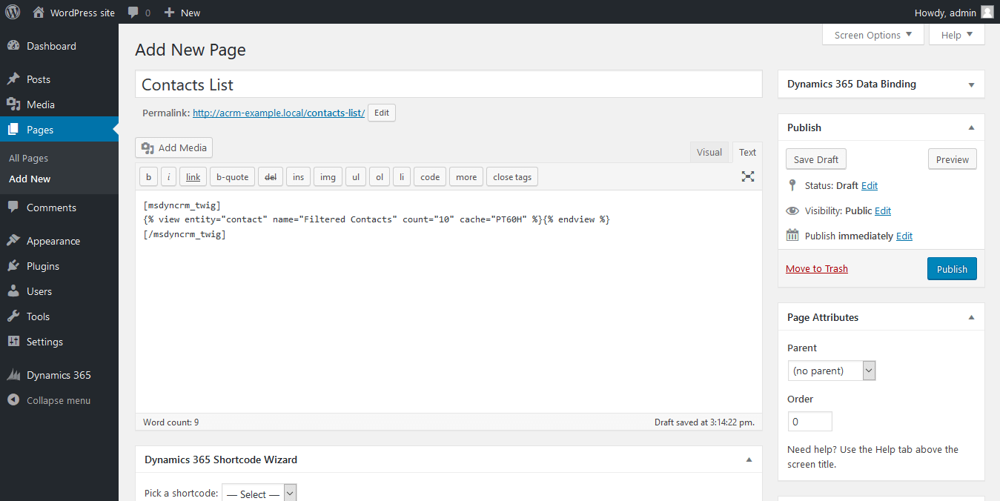

Click *Publish* button on the right sidebar to publish your new page or *Update* button if you are editing an existing page.

Now you should see retrieved data from Dynamics 365 on a website page.


You can find more information about creating views at the [Twig Templates documentation page](twig#views)


## Entity Binding

You can also bind CRM entities to WordPress pages dynamically by using Entity data binding functionality.. These bindings can be set automatically with default Twig-templates, by using the **Set default for views** option, or you can override the default template to create links between pages manually.
First, we will create an automatically binding between the two previously created pages, with a list of contacts and a new cotact form.

### Surfacing record using default page binding

Open the page where the contact form is located and setup a binding to the *Contact* entity, as shown in the screenshot below. Select the *Contact* entity from the drop-down list and select checkbox **Set default for views**. After that change the *form* tag in *Content* text field as follows:

```twig
[msdyncrm_twig]

[/msdyncrm_twig]
```

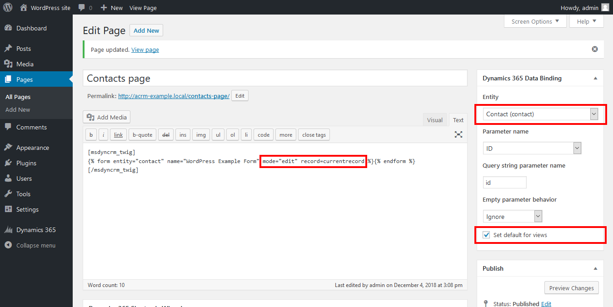

Thereby, we just linked the form on this page with the *Contact* entity from Dynamics 365 instance and specify that this page should be used as the default page for displaying *Contact* entity records for the entire site. Note that for each entity only one default page can be set, i.e. if we checked the **Set default for views** checkbox on the current page, then for all other pages with the *Contact* entity binding it will be deactivated.

Also, we specify that form on this page should display the fields of the record of the binded entity (in this case it is *Contact*) and the id of the selected record is passed by the url-parameter *id*.

Now return to the page of the site where we placed a list of contacts, you should see that each entry now has a link that way you you to a page with a contact form, where the fields are already filled with data of the selected record. If you edit the form and submit it, selected record's data will be sent to Dynamics 365 application. All this will be done automatically, only with the use of the pre-defined tags.

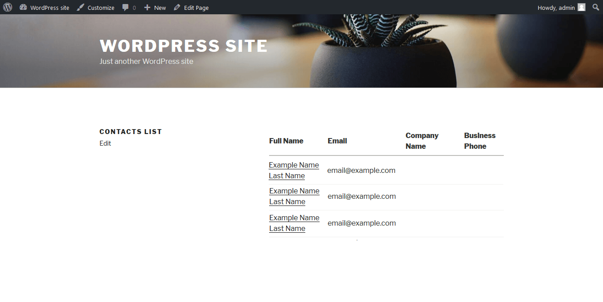

### Surfacing record using custom view template

You can also specify your own custom template for view to customize the displaying of records and provide links to related pages manually.

For example, let's change default table view to more flexible one using this template:

```twig
[msdyncrm_twig]

<div class="contacts-list">
  
    <div class="contacts-row" style="margin: 2em 0;">
      <h4>
        <a href="{{ entityUrl( 'contact', recordId ) }}">{{ record['fullname'].value }}</a>
      </h4>
      
        <div>email: {{ record['emailaddress1'].value }}</div>
      
      
        <div>phone: {{ record['telephone1'].value }}</div>
      
    </div>
  
</div>

[/msdyncrm_twig]
```

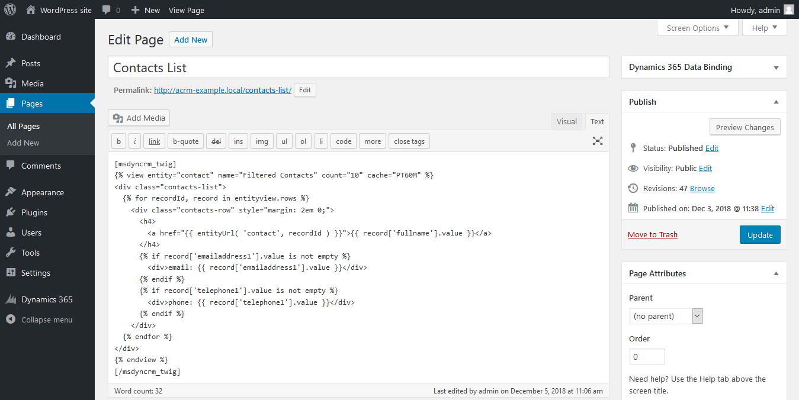

Here we use `entityview.rows` variable to loop through all records of *Contact* entity. To build correct links for each record we use the `entityUrl(entityName, recordId)` function. More information about aviable variables, filters and functions you can find at the [Twig Templates documentation page](twig#global-objects)

Now you can see that layout of contacts list page has been changed according custom template.

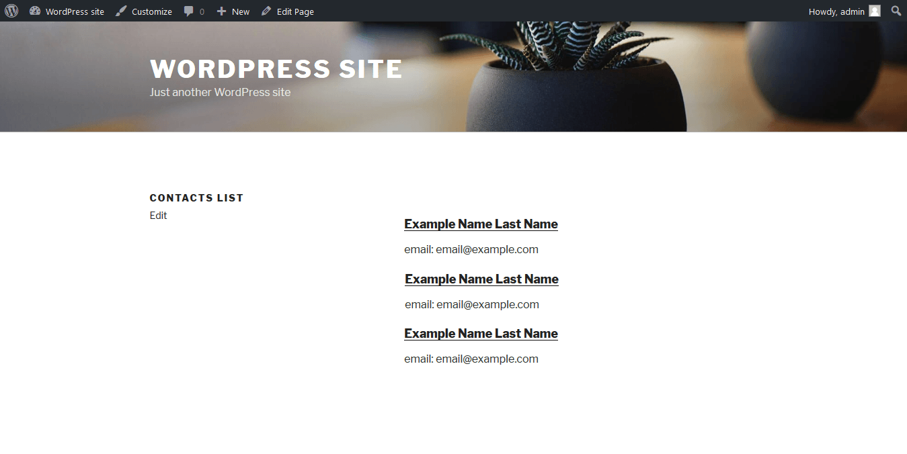

Default built-in template for views is located in `templates/twig/view.twig` within **Dynamics 365 Integration** installation directory.

You can find more information about Entity data binding at the [Entity Binding documentation page](binding)